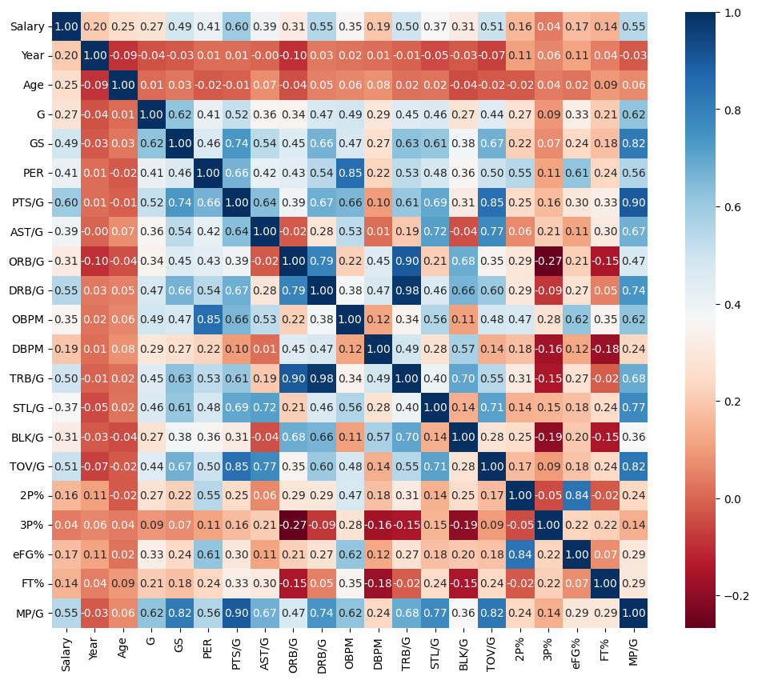
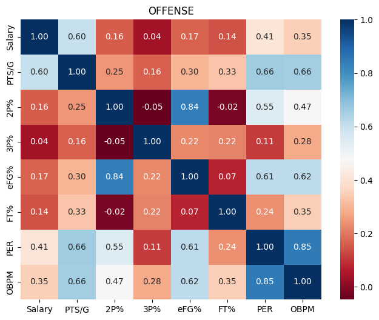
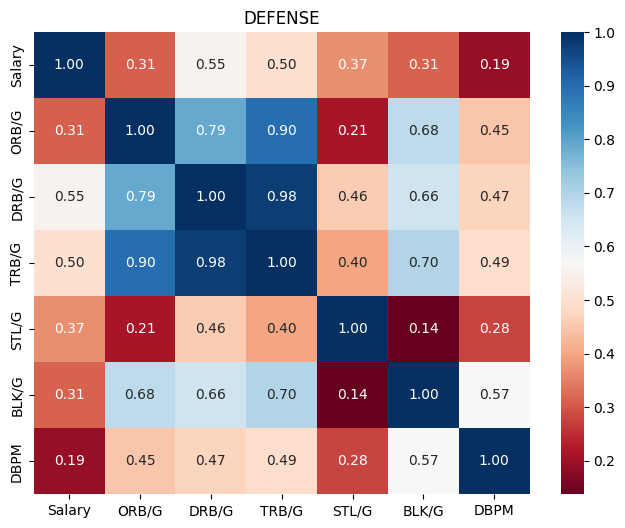
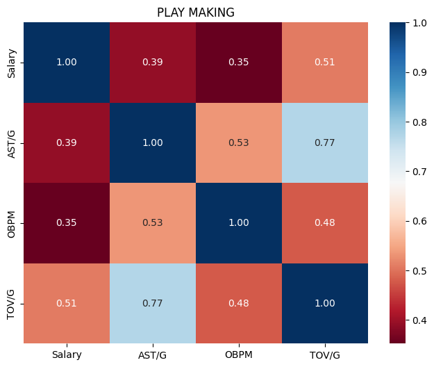
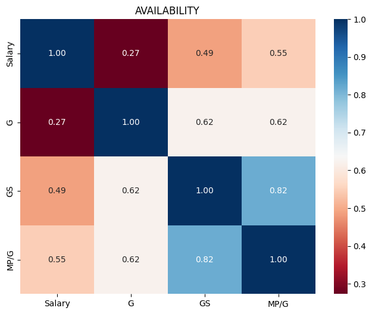

# ECS171_ML
## Contributors
Allen Benjamin, Adib Guedoir, Aldo Sandoval

## Relevant links
Jupyter Notebook: https://colab.research.google.com/drive/1gr8wDl2S0fZCBton-ok_G3Bs-UDh4Vc7?usp=sharing 

Dataset: https://data.world/nolanoreilly495/nba-data-with-salaries-1996-2017

# Abstract
The National Basketball Association (NBA) is one of the largest sports organizations in the world and is worth over 90 billion dollars. Every season teams are set a league-wide team salary cap, currently set to 137 million dollars to build a championship-caliber team. Although the objective of the game has remained the same, the style of play seems to change constantly, emphasizing different attributes. With limited cap space, teams have to decide how to distribute their funds appropriately. Signing a star player to the team greatly impacts the available funding, whereas signing a role player allows for more financial flexibility. Our project will make projections using Regression Models a branch of Supervised Machine Learning on what a worthy salary is for an NBA player based on their performance and position relative to the current state of the NBA. We will use an NBA data set which contains 12,378 rows and 51 columns of information about each team’s roster from the years 1996-2017. Each player that was listed on that roster that season is also included, along with information about them such as, their position, age, and in-game statistics. These in-game metrics are used to analytically describe the player’s performance.  


# Introduction
We believed this would be a fun and intresting project beacuse it combines two of our favorite things sports and computers. While this group does not share any favorite teams in fact our favorite teams are rivals we hoped that applying Machine learning to the data set filled with in NBA players' in game stats would indicate how the game has evolved over time and which apsects are more valuable in present day. It was our desire that after building an accurate model to predict the salary, we would be able to input new players along with their stats and have the model determine their monetary value. Then I would be able to brag how our rival team overpaid for a player. We also hoped the this project would be a great way to apply things we learned in class to the real world.


# Methods

## Data Exploration
In our data exploration, we first got a general overview of the correlation between each attribute amongst each other by dropping our ‘Players’ column and then visualizing the data with a correlation matrix, which is represented by a heatmap. 
Moreover, we plotted another heatmap to display the correlation between salary and the different aspects of the game, such as offense, defense, playmaking, and availability.


We set the data we'd like to analyze by first defining our dependent and independent variables. Our dependent variable 'y' is the annual salary that each player receives. Our independent variable 'X' holds the values that represent important statistics in a basketball game, including position, year, age, games played, games started, player efficiency rating, points, assists, offensive/defensive/total rebounds, offensive and defensive efficiency, steals, blocks, turnovers, shooting percentage, and minutes played.

## Preprocessing
For accurate results, we first needed to clean our data. To analyze salaries for each position, we assigned the individual positions and merged the ones that represented multi-position players (e.g. a player with the position ‘SF-C’ would be converted to ‘SF’). Next, we defined the attributes that we wanted to analyze by selecting the ones we felt impacted a player’s value the most. 

```
stats = ['Player','Salary','Pos', 'Year', 'Age', 'G', 'GS', 'PER', 'PTS/G', 'AST/G', 'ORB/G', 'DRB/G', 'OBPM', 'DBPM', 'TRB/G', 'STL/G', 'BLK/G', 'TOV/G', '2P%', '3P%', 'eFG%', 'FT%', 'MP/G'] 
```

We then took the instances that held ‘N/A’ values within the attributes and filled them in with the average value for that column.

Of the nearly 13,000 rows of data, approximately 2,000 of them contained instances where the earned salary for a player was 0. For the purpose of this project, we only want to analyze the players who have an active salary, so we removed those rows from our data.

Next, we broke down the attributes into more specific aspects of basketball such as offense, defense, playmaking, and availability. 

Furthermore, we clustered specific ranges of years that had the smallest difference in salary cap in the NBA. These three groups include the years 1996-2000, 2001-2007, and 2008-2017. To further classify our data, we broke it down by each position ('PG', 'SG', 'SF', 'PF', and 'C').

```
score_eff = ['Salary','PTS/G','2P%', '3P%', 'eFG%', 'FT%', 'PER', 'OBPM'] # Scoring and Efficiency
defense = ['Salary','ORB/G', 'DRB/G','TRB/G', 'STL/G', 'BLK/G', 'DBPM'] # Defensive
play_making = ['Salary','AST/G','OBPM','TOV/G'] # Playmaking
availability = ['Salary', 'G', 'GS', 'MP/G'] # Avaliablity
```

## Model
For this project we used Supervised Learning Regression models. In specific we used Linear Regression and Polynoimial Regression. We decided to use linear regression since we had a data set the was labeled, with varies numerical data and with a specific target as a column. As we learned in class linear regression is useful when you have a matrix X and a column vector y. In our case after cleaning the data we set our feature matrix X to include the specified in-games statistics and the 'Salary' column as our target y. To standardize the data we tried both MinMax and Z-Score scalers but ultimately kept MinMax as it yeild better results. After our training our linear regression model we expanded to the Polynomial regression of degree 2. We hope this type of model would fit the data better due to its curve like graph since not all statitics are closing correlatated.


# Results

## Data Exploration
This is the heatmap of the correlation between all aspects of our data:


These are the heatmaps for the specific aspects of the game (offense, defense, playmaking, availability)









## Preprocessing
After cleaning our data and filtering the positions, features, period, and N/A values, we have this:
```
NBA DATA SET
Positions:  ['C' 'PF' 'SF' 'PG' 'SG']
Features:  ['Player', 'Salary', 'Pos', 'Year', 'Age', 'G', 'GS', 'PER', 'PTS/G', 'AST/G', 'ORB/G', 'DRB/G', 'OBPM', 'DBPM', 'TRB/G', 'STL/G', 'BLK/G', 'TOV/G', '2P%', '3P%', 'eFG%', 'FT%', 'MP/G']
Data Period:  [2017, 2016, 2015, 2014, 2013, 2012, 2011, 2010, 2009, 2008, 2007, 2006, 2005, 2004, 2003, 2002, 2001, 2000, 1999, 1998, 1997, 1996]
Columns w/ NA:  ['PER', '2P%', '3P%', 'eFG%', 'FT%']
Columns w/ NA after cleaning:  []
Data Rows:  9409
Data Columns:  23
```

We then obtained the average salary for each player for each year and then grouped them into different ranges:
```
Average Salaries:  [1710539.0, 1980512.0, 2289899.0, 2511917.0, 2823992.0, 3358028.0, 3372248.0, 3577774.0, 3601343.0, 3675149.0, 3784542.0, 3902860.0, 4225603.0, 4581743.0, 4458596.0, 4336169.0, 4169421.0, 4189944.0, 5042071.0, 4166249.0, 4508850.0, 5657306.0]
Group 1:  [2000 1999 1998 1997 1996]
Group 2:  [2007 2006 2005 2004 2003 2002 2001]
Group 3:  [2017 2016 2015 2014 2013 2012 2011 2010 2009 2008]
```

Next, we broke them down by each position and then categorized them into different aspects of basketball:
```
Years 1996-2000

Aspect OFFENSE
Stats:  ['3P%', 'OBPM', 'FT%', 'PER', 'eFG%', '2P%', 'PTS/G']

Aspect DEFENSE
Stats:  ['DRB/G', 'ORB/G', 'DBPM', 'STL/G', 'BLK/G', 'TRB/G']

Aspect PLAY MAKING
Stats:  ['AST/G', 'TOV/G', 'OBPM']

Aspect AVAILIBILTY
Stats:  ['G', 'GS', 'MP/G']
```

## Model
These are our outputs for our first linear regression model:
```Linear Regression Model
Data Features:  ['Year', 'Age', 'G', 'GS', 'PER', 'PTS/G', 'AST/G', 'ORB/G', 'DRB/G', 'OBPM', 'DBPM', 'TRB/G', 'STL/G', 'BLK/G', 'TOV/G', '2P%', '3P%', 'eFG%', 'FT%', 'MP/G']
Target: Salary
TRAINING Mean Squared Error is:  8677232253245.942
TESTING  Mean Squared Error is:  9004849118587.037
```

Outputs of linear regression for grouped years with different aspects of the game:
```Linear Model for Salary Groups and Specific Statistics

Years 1996-2000

Aspect OFFENSE
Stats:  ['3P%', 'OBPM', 'FT%', 'PER', 'eFG%', '2P%', 'PTS/G']
TRAINING Mean Squared Error:  4862163147797.9
TESTING  Mean Squared Error:  3866172462549.382

Aspect DEFENSE
Stats:  ['DRB/G', 'ORB/G', 'DBPM', 'STL/G', 'BLK/G', 'TRB/G']
TRAINING Mean Squared Error:  4878064325894.496
TESTING  Mean Squared Error:  3397144784734.2983

Aspect PLAY MAKING
Stats:  ['AST/G', 'TOV/G', 'OBPM']
TRAINING Mean Squared Error:  5769655248139.349
TESTING  Mean Squared Error:  4063849604211.781

Aspect AVAILIBILTY
Stats:  ['G', 'GS', 'MP/G']
TRAINING Mean Squared Error:  5518561691544.87
TESTING  Mean Squared Error:  3623977016904.963


Years 2001-2007

Aspect OFFENSE
Stats:  ['3P%', 'OBPM', 'FT%', 'PER', 'eFG%', '2P%', 'PTS/G']
TRAINING Mean Squared Error:  8886551663738.182
TESTING  Mean Squared Error:  10452430302321.023

Aspect DEFENSE
Stats:  ['DRB/G', 'ORB/G', 'DBPM', 'STL/G', 'BLK/G', 'TRB/G']
TRAINING Mean Squared Error:  9322991725995.299
TESTING  Mean Squared Error:  10897387903693.875

Aspect PLAY MAKING
Stats:  ['AST/G', 'TOV/G', 'OBPM']
TRAINING Mean Squared Error:  9902700620412.766
TESTING  Mean Squared Error:  11872235022760.121

Aspect AVAILIBILTY
Stats:  ['G', 'GS', 'MP/G']
TRAINING Mean Squared Error:  9409583138135.666
TESTING  Mean Squared Error:  11206553119904.953


Years 2008-2017

Aspect OFFENSE
Stats:  ['3P%', 'OBPM', 'FT%', 'PER', 'eFG%', '2P%', 'PTS/G']
TRAINING Mean Squared Error:  14946094476376.242
TESTING  Mean Squared Error:  11864016001379.627

Aspect DEFENSE
Stats:  ['DRB/G', 'ORB/G', 'DBPM', 'STL/G', 'BLK/G', 'TRB/G']
TRAINING Mean Squared Error:  15721439432896.457
TESTING  Mean Squared Error:  12850302318646.842

Aspect PLAY MAKING
Stats:  ['AST/G', 'TOV/G', 'OBPM']
TRAINING Mean Squared Error:  17115088757551.688
TESTING  Mean Squared Error:  13948398386212.086

Aspect AVAILIBILTY
Stats:  ['G', 'GS', 'MP/G']
TRAINING Mean Squared Error:  16232899420678.766
TESTING  Mean Squared Error:  12802396591989.824
```

# Discussion
## Preprocessing


## Data Exploration
Knowing that there was going to be issues trying to directly correlate stats to player salary, we decided to group players’ stats by grouping them into different aspects of the game. We did this with the use of heat maps. To get an overall picture of this relationship, we started with a big heatmap to demonstrate the correlation between all of their stats.

The heatmap gave us a better understanding of what different stats translate into aspects of play we want to evaluate. This also helped determine how good a player is at their position. For instance, a shooting guard, who is typically smaller and plays further away from the basket is not evaluated on their ability to rebound the ball as much as a center who is typically the main rebounder. Since different players’ positions are judged by different stats, it is important that we differentiate the aspects of the game with different positions, so that we can properly predict players’ salaries based on their skill. 

Next, we broke down different aspects of basketball into their own heatmaps to make sure we were properly evaluating them based on various stats. 

We made a heatmap of the stats we determined best represent offense in basketball. Almost all of the stats were positively correlated with each other besides a very small negative correlation between 2-point shooting percentage and 3-point and free throw percentage. This would make sense since some players are better at shooting farther away from the basket while other strictly layup or dunk the ball. 

For defense, all of these stats are positively correlated with the lowest one being 0.21, these are in fact indicative of  defensive ability.

Once again the consistently positive correlations for playmaking attributes demonstrates why we grouped these stats together to describe playmaking. This will be the most helpful for evaluating point guards, as they handle the ball the most throughout a game. 

The category we made called “availability” is just based on how much a player was present throughout the season. Minutes per game is greatly correlated with games started. This would make sense since coaches tend to start their best players and the best players usually play the most.

## Models
Since our objective was to find which in-game statistics were the best indicators for the total salary a player earned for the year we decided to do a linear regression model. Our hope was that the model would be able to identify the most important feature that correlated to the target. For our features matrix ‘X’, we dropped the columns that were strings and did not make sense to include in the data which were ‘Player’, ‘Position’, and ‘Salary’. The ‘Salary’ column we set up as our target vector ‘y’. We then split our data using the ‘train_test_split()’ function into 80% for training and 20% for testing. We then standardized our data using the ‘MinMaxScaler()’ for both our training and testing data. However, for our training data, we both transformed and fit the data while only transforming the testing data. Using the linear regression model from sklearn, ‘LinearRegression()’ we create a model labeled ‘model1’. We then trained the model with the standardized data and the ‘y_training’ data, using the function model1.fit(X_train_standardized, y_train). After training the model we got our prediction ‘yhat_train’ for the training data and ‘yhat_test’ for our testing data. To see how well our model did we used the Mean Squared Error (MSE) metric for both data sets. However, we had extremely large numbers for both sets, our MSE for the training data was 8677232253245.942 and our MSE for the testing data was 9004849118587.037. 

This model was not good. For our next model, we decided to use a Polynomial Regression model of degree 2. Similarly to the linear regression model we removed the unnecessary columns, standardized the data sets then applied the Polynomial model using ‘PolynomialFeatures()’. After we transformed and fitted out training data and only transformed out test data. We also used MSE as our measuring metric and got an MSE of 6515867731483.319 for our training data and an MSE of 6985161144957.786 for our testing data. Again this is not good. 

We realized that a possible reason our model is just not good is because our target ‘Salary’ has varied over time due to inflation and increased Salary Cap. After getting the average salary for every year we determined 3 groups for which we would train and test individually due to their similar salary average. The first group was from the years 1996-2000 with an average salary of $2 million, the second group was from 2001-2007 with an average salary of $3 million, and the third group was from 2008-2017 with an average salary of $4 million dollars. We then used the same linear regression model as above with a MinMax scaler.  As a result, we got 2 MSE for each of the years. Although we saw a decrease in 2 out of the 3 groups our MSEs were still very large at a scale of 10^13.

Believing there was still too much discrepancy in our data we further divided our data. For this model, we still used linear regression on each of the three groups. However, we divided the groups by position meaning in total we had 15 different groups which would lead to 15 different models. We hope that the model’s MSE will decrease. After following the same steps as our previous linear regression model. Our result MSE was still extremely large.

In our final model, we decided to do feature selection on our data and divide the in-game statistics we mentioned into 4 categories that describe the aspects of the game. The aspects were ‘Offense’, ‘Defense’, ‘Play Making’, and ‘Availability’.  While still maintaining the 3 groups divided by their average salary we ran a linear regression model with the data frame modified to only feature the attributes from the specific aspects. Once again we found our MSEs to be very large and saw no significant improvement. In the same data frames, we ran a model of polynomial regression to degree 2 and saw worse performance than the linear equivalent.

# Conclusion
Overall, we found this to be a very fun project, as the topic is related to something our team really enjoys. We found reasonable results when constructing our correlation matrices, as they seemed to accurately represent the correlation between certain statistics. For example, a player with a high 3-point shooting percentage was projected to also have a higher free throw percentage. 

However, we did have some shortcomings. Our MSE was very large and we believed that it was due to the large number that is the salary of the player, which is typically in millions.

## Collaboration Statement
Allen Benjamin, Collaborator

Adib Guedoir, Collaborator

Aldo Sandoval, Collaborator


We all worked together as a team and consistently met through Discord to work on our project. We communicated with each other throughout and each contributed to the milestones. Everyone was on the same page about what we wanted to accomplish, and we worked as a team by contributing code and making suggestions on how to approach each section, from preprocessing to our final model. There was no lack of effort by anyone throughout the project and we had great team chemistry.
